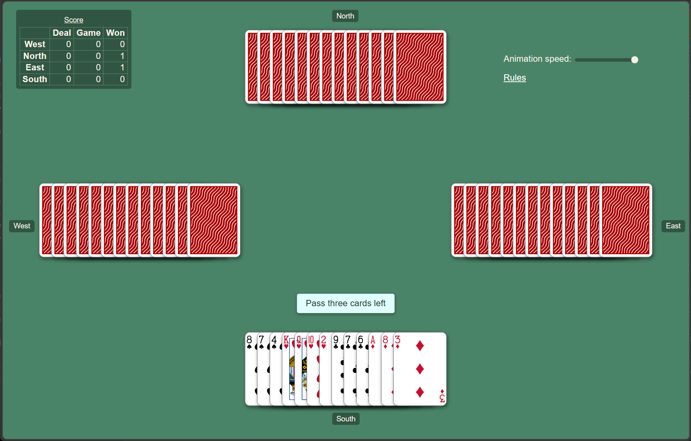

# Crushing Hearts with Deep CFR

♠️♥️♦️♣️ [Play Hearts against a superhuman AI](https://www.bernsrite.com/Hearts/) ♣️♦️♥️♠️

## Overview

The card game [Hearts](https://en.wikipedia.org/wiki/Hearts_(card_game)) is difficult for a computer to master because it has a large game tree with elements of chance and uncertainty. [Deep Counterfactual Regret Minimization](https://arxiv.org/abs/1811.00164) (Deep CFR) is an algorithm designed specifically to tackle such games. We use a simplified version of Deep CFR to train an AI that plays Hearts at a superhuman level!

## Background

### Perfect information games

Games like Tic-Tac-Toe and Chess are called "[perfect information](https://en.wikipedia.org/wiki/Perfect_information)" games because each player knows all relevant information about the state of the game. Nothing is hidden from the players in such games.

Playing Tic-Tac-Toe well is much easier than playing Chess well, though, because Chess has a much larger "[game tree](https://en.wikipedia.org/wiki/Game_tree)" of possible moves. An AI that plays Tic-Tac-Toe perfectly can be written in a few lines of code, but a program that plays Chess well is much more difficult to create. In recent years, great progress towards this goal has been achieved by deep learning programs like [AlphaZero](https://en.wikipedia.org/wiki/AlphaZero), which mastered Chess by playing against itself for a few hours.

### Imperfect information games

AlphaZero doesn't do as well with "imperfect information" games like Rock-Paper-Scissors (RPS) or Poker, however. In these games, some information is hidden from the players,[^1] which introduces a role for chance in the game. A beginner Poker player can sometimes beat an expert, depending on the luck of the draw. Card games typically have imperfect information, because players have "hands" that they keep private. Bridge is another example of such a card game.

In imperfect information games, a good strategy sometimes involves a degree of randomness. For example, the best strategy in RPS is to choose your hand shapes randomly. Bluffing in Poker is another example of strategic random behavior. Over time, a Poker player who never bluffs isn't going to win as much as a player who bluffs well at the right time.

A strategy is called a "[Nash equilibrium](https://en.wikipedia.org/wiki/Nash_equilibrium)" if (roughly speaking) there is no other strategy that can beat it over the long run. However, such a strategy doesn't do anything to exploit weaknesses that might exist in other strategies. For example, the Nash equilibrium in RPS is to play randomly, but against a player who always chooses Rock, an even better strategy is to always choose Paper. An imperfect information game might have multiple Nash equilibria, rather than a single best strategy.

We have to rethink the idea of a game tree for imperfect information games, since multiple game states might be indistinguishable to a player, given their imperfect knowledge (e.g. they don't know the cards in other players' hands). Instead, we consider a graph where each node represents all of the active player's information about the state of the game when it is their turn to play. Each such node contains one or more distinct game states (from the point of view of an omniscient observer) and is called an "information set".

### Counterfactual regret minimization

As with perfect information games, imperfect information games can have a small number of information sets (e.g. RPS) or a large number (e.g. Bridge). There's a powerful machine learning technique for solving imperfect information games called [counterfactual regret minimization (CFR)](https://github.com/brianberns/CFR-Explained), but it is only practical for fairly small imperfect information games, because it must visit each information set many times as it iterates to a good strategy.

CFR works by minimizing "counterfactual regret" at each information set. Regret is a confusing concept (at least to me), so I prefer to think of this as maximizing the value (aka "utility" or "advantage") of each node instead. Roughly speaking, the idea is to start with a random strategy and then refine it so that actions with high value are favored. In this way, CFR "learns" how to play well over time.

However, due to the nature of imperfect information games, we have to be careful about evolving strategies that chase their own tail. For example, in RPS, CFR might start off with a bias towards Rock due purely to random accident. In the next iteration, it would learn to play Paper more often in response. Then in the next iteration, it would learn to play Scissors in order to take advantage of the bias towards Paper, and so on. In order to avoid this, CFR takes the average of all strategies at the end of the run, rather than keeping just whatever the last strategy happened to be. Over many iterations of RPS, CFR finds that the average value of Rock, Paper, and Scissors are all ⅓, which gives us the best strategy. It is only this average over time that is guaranteed to converge to a Nash equilibrium. Visually, we can think of CFR as circling endlessly around this average strategy, rather than necessarily landing right on it.

### Deep CFR

CFR keeps a table of regrets and strategies for each information set. This quickly becomes untenable for many games, due to the exponential explosion of game tree sizes. For example, Bridge has at least 1050 information sets, which is far too large to track individually.

To address this problem, [Deep Counterfactual Regret Minimization](https://arxiv.org/abs/1811.00164) (Deep CFR) uses a deep neural network to approximate the table instead. The input to the network is an information set, and the output is the network's estimation of the value of each action in that information set.

The basic idea is:

1. Start with a model for each player that plays randomly.
2. Generate sample data by playing the current models against each other for many games. At various decision points within these games, compute the value of each legal action by comparing the predicted outcome of the action to the actual outcome of taking that action.
3. Train new versions of the models using the comparisons generated in the previous step, along with comparisons generated by earlier iterations. (If the amount of training data becomes too large, use "[reservoir sampling](https://en.wikipedia.org/wiki/Reservoir_sampling)" to prune it.)
4. Repeat from step 2 for multiple iterations.

As with vanilla CFR, however, the strategy learned by this process is not guaranteed to converge on a Nash equilibrium. Instead, we need to train a final network for each player at the end of the run that approximates the average strategy across all iterations.

Deep CFR is designed to work specifically for two-player zero-sum games. Each player requires a separate model, because (for some games) they use different strategies depending on their role (e.g. seat order). Deep CFR has been used successfully to master complex imperfect information games, such as a popular Poker variant called Texas Hold'em. And now, Hearts as well!

## Hearts and Deep CFR

To the best of my knowledge, there have been few attempts to create strong Hearts-playing programs, and most of those that do exist are based on heuristic rules, rather than rigorous algorithmic techniques. The website [Trickster](https://www.trickstercards.com/games/hearts/), for example, has written [such a program](https://github.com/TricksterCards/TricksterBots/blob/main/TricksterBots/Bots/Hearts/HeartsBot.cs), but it does not play Hearts at a high level. My father, Gerald Berns, also created a heuristic program called [*Killer Hearts*](https://mark.random-article.com/hearts/on_hearts.txt) that was, I believe, the best Hearts program in existence prior to this project.

"Shooting the moon" makes Hearts particularly difficult to master for both computers and humans. A good Hearts player cannot focus on just minimizing points taken. They must also be able to shoot the moon when possible, and try to prevent other players from shooting the moon. Balancing these goals requires a great deal of acumen.

Although Hearts is neither a two-player nor a zero-sum game, this project serves as a demonstration that it is still a good candidate for Deep CFR, with some adaptations.

### Simplifying Deep CFR

Several simplifications to Deep CFR are possible when applying it Hearts:

1. Since Hearts strategy is the same for all players, there is no need to train a separate model for each player. Instead, all players can share the same model.
2. Because misdirection and bluffing are not a major part of Hearts strategy, the "tail chasing" behavior of CFR described above is not a concern. Empirical results show that the strategy network converges directly on a Nash equilibrium after less than ten iterations. There is no need to train a separate network on the average strategy.
3. For the same reason, training data from earlier iterations is less important for keeping the strategy evolution "on track" to a Nash equilibrium. Instead of reservoir sampling, we can train the next iteration using data generated only by recent iterations.[^2] This speeds up the training phase considerably.

### Adapting Hearts

#### Zero-sum, two-player game

There are 26 points in each Hearts deal: one point for each Heart card, and thirteen points for the Queen of Spades.

To convert Hearts to a zero-sum game, we define a payoff function that subtracts each player's score from the average score of the other players. This ensures that the sum of all payoffs is zero. For example:

Seat | Points | Payoff
-----| -----: | -----:
West | 2 | 6
North | 5 | 2
East | 0 | 8⅔
South | 19 | -16⅔
*Sum* | *26* | *0*

Note that the sign of the payoff is reversed so that taking more points results in a lower payoff. Taking more than 8⅔ (= 26/3) points in a (non-shoot) deal results in a negative payoff for that player. Shooting the moon has a payoff of 26 points, regardless of whether points are subtracted from the shooter's score or added to the other players' scores.

Using this payoff function, Hearts can be seen as a cutthroat two-player game in which each player is simply trying to maximize their own payoff versus the combined payoff of the other players.

#### Non-cooperation

Because Hearts ends when one of the players reaches 100 points, it can sometimes benefit players to cooperate near the end of a game, in order to avoid going over the limit. Modeling this from a game theory point-of-view requires a different game-level payoff function. Is it better to play it safe and finish in second place rather than take a big risk and finish last? If two players tie for first place, does this dilute their accomplishment? One simple answer is to reward one point to each winning player (including ties) and no points to the other players.

For the time being, this project ignores the game-level payoff entirely, and focuses only on the score within the current deal. Like the [fabled scorpion](https://en.wikipedia.org/wiki/The_Scorpion_and_the_Frog), players never cooperate, even when it means their own destruction. This approach is nonetheless still good enough to dominate game-aware heuristic players, like *Killer Hearts*, over the course of a full game.

[^1]: I think "hidden information" would have been a better name for these types of games. "Incomplete information" might have also been a good name, but that actually means something [completely different](https://web.stanford.edu/~jdlevin/Econ%20203/Bayesian.pdf). Game theory is confusing sometimes.

[^2]: In fact, it might be possible to use only training data from the most recent iteration, but I haven't proven this yet.